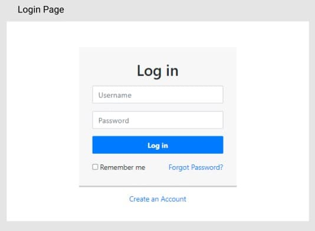

# CSS 410 Research tools and methods
## Team members
+ **Akmyrza Darkhan** 180107261 -Akmyrza Darkhan Backend Developer 
+ **Maksotuly Zhangabek** 180107181 - Frontend Developer 
+ **Bolat Zhanserik** 180107061 - Frontend Developer 

## Project
This project is in the field of serving cafe, restaurants. With this app you can order food in restaurants using qr. and you don't have to waste time waiting for an waiters or another problems. Our clients will always be comfortable with our product, as they will use one single application that will be in all cafes and restaurants.

## Alternatives / Market research
This product is not very well implemented in the KZ, we can say that there is no such thing yet. Only very developed countries like China and Japan use this in their cafes and restaurants. 

## Technologies
Java, kotlin, spring boot, postgresql, javascript, vueJs, html, css  

## Pages / Activities 
We will have following pages:
- Main Page 
- Login/ Registration Page 
- Catalog of Menu 
- Detail Product Page 
- Basket Page

## Goals
The purpose of our application is to use time more efficiently in restaurants. With this application, you can reduce the number of employees, thereby improving the quality of restaurants

## User Personas
1) Young parents, aged 18 to 35, both work hard from 9 to 6, have children, send their children to kindergarten every day except weekends. On weekends they clean the house. 
2) Student, 21 years old, either studying at the university, or working as a developer, living with classmates. Dreams of becoming a FAANG employee. On weekends mostly coding on leetcode. Likes to code on weekends at Starbucks
3) Anime guy who is 15 years old and is a student. Favorite hobby is watching anime. He spends all his leisure time watching anime. Also he can watch 30 episodes per day
4) Child, age 5, goes to kindergarten, wants to become adult on weekends usually go outside for play with friends. on leisure time spend on mobile and on tv. Main hobby is watching cartoon and loves to listening shark to do baby

## User stories
1) As a cafe administrator, want to minimize number of waiter, while makeing my clients feel comfortable in the cafe. So they don't have to wait for the menu. In addition, the food was delivered instantly, if the client needs a waiter for some purpose, the waiter will be available at that moment. As a result, find out the opinion and assessment of the client about the cafe and the dish
2) As an employer a waiter. I don't want to go and give menus to every customer who comes. Also, wait for them to choose a meal from the menu, or come back to ask what they have chosen. Also, it's tricky while you're serving one customer, other customers are asking for their service, which complicates me and leads to forgetting customer requests
3) As a customer, I want to have a lunch immediately and don't want to wait for a menu long. Also when waiter come with menu I would like to know in how much minute will be ready as I am hungry and can not wait for long. In addition I would like to know what is consist of food as I don't eat food with sugar and pig .
4) As a client who is introvert, I would like to not talk with waiter instead call him when I need it. Sometimes I sit and work at cafe and want to order something later , so it will make me uncomfortable and break my concentration when someone comes and asks me what WILL I order.

## Sitemap, Page descriptions
* Main Page - is a page where you can sign in or register and you can see all information about the site. Using this page you can go to other pages.
* Login/Register Pages - are pages that you register and login. To use our website, you must first register.
* Catalog of Menu - in this page you can see the menu of the selected restaurant. And you can order the food. If you don't like certain foods in your food, you can eliminate that food. for example, you don't want to have a onion, etc. And you just pick no  onion.
* Detail Product Page - in this section you can see the ingredients of  selected meal. There will be full information about the food.
What kind of people can't eat, what person can eat.
* Basket Page - this page contains meals that you chose. Still you can save your favorite food etc.

## Non-Functional requirements
The application must be build java, spring, javaScript vueJs.
The application will be used 100 active users.
The application must be hosted in web server.
The application must work in all modern browsers

## Risks
At lunch and evening might have problems on server as all the client's come to cafe, it can be solved if our application will be popular, we will have investors and will buy server for more clients. Someone wants to do fishing by changing qr code, so Client thinks that have to pay after choosing menu. It can be prevented by note on table. 
Business: Initially might have problems with QR, As client's  don't know why it's needed. Even they can wait for long for a waiter as they wait for system. There might be problem with elderly people as they don't know how to use mobile phone properly and are not able to make any order.

## Mockups, Wireframes

## Future iterations
As technology gets more innovatived, we will need innovative solutions current tasks. And scanning with qr code is one of them. At first it might be problems with people as they don't used to it. But in the end it will be more popular which everyone will use qr code to order. As, each person has mobile on their pocket. In addition menu will be changed easily.

## Youtube proposal video
https://youtu.be/sUm423c6ZFM
